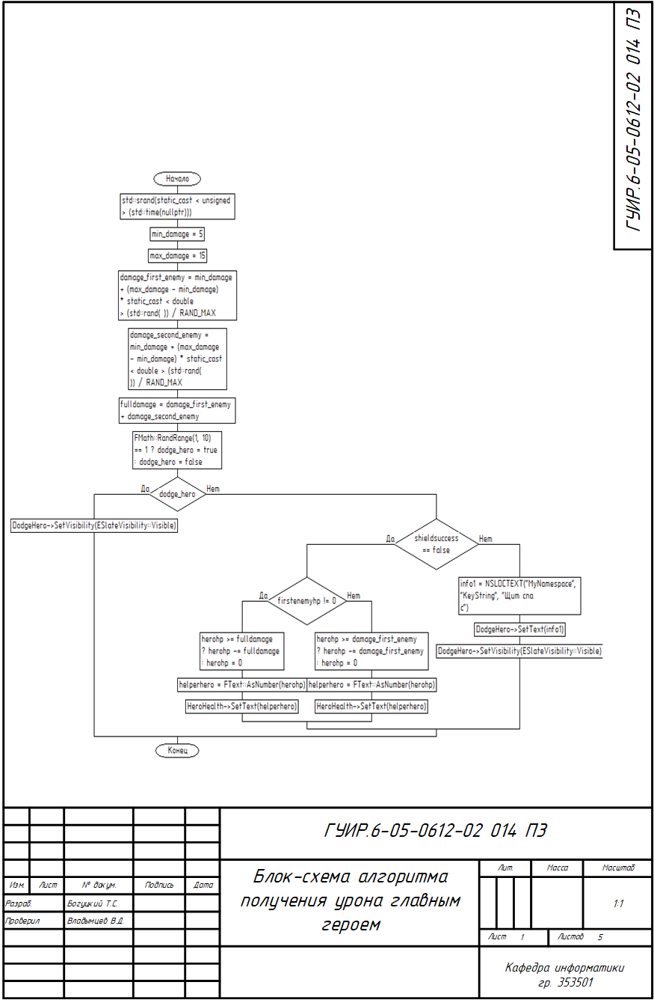
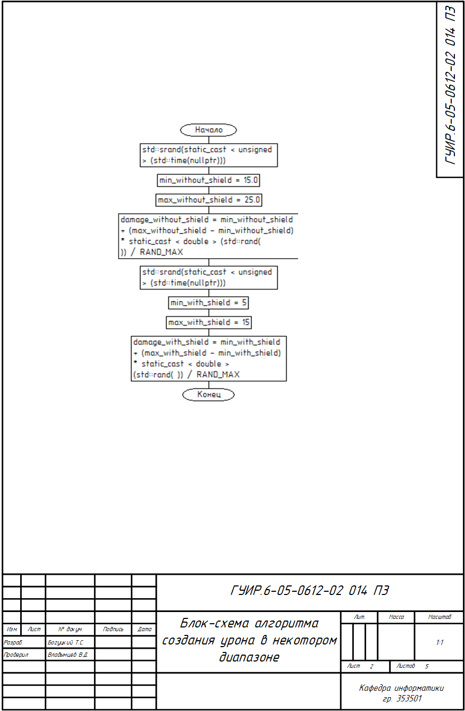
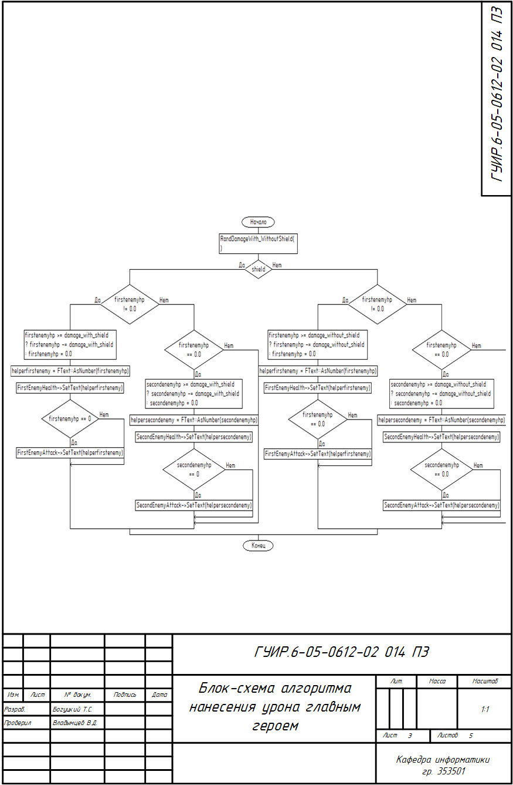
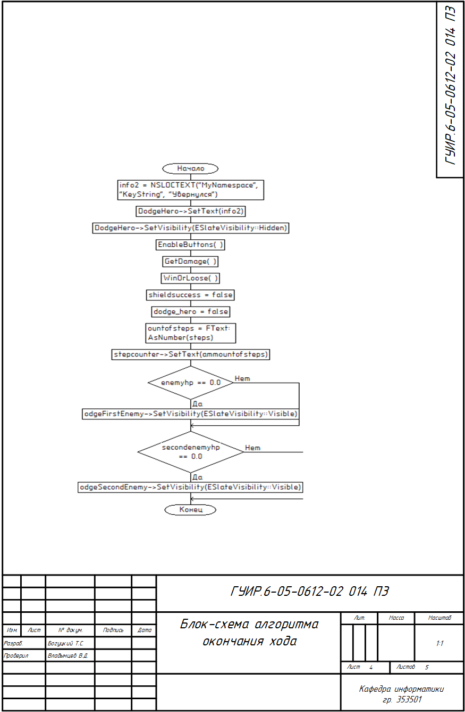
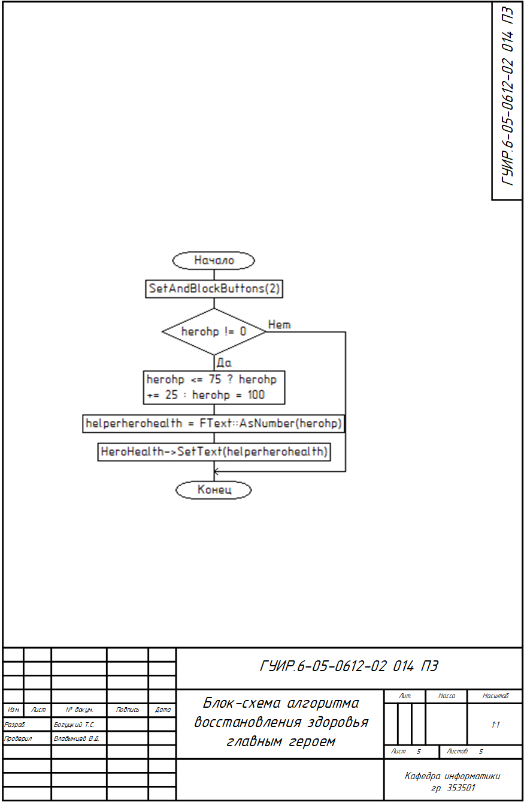
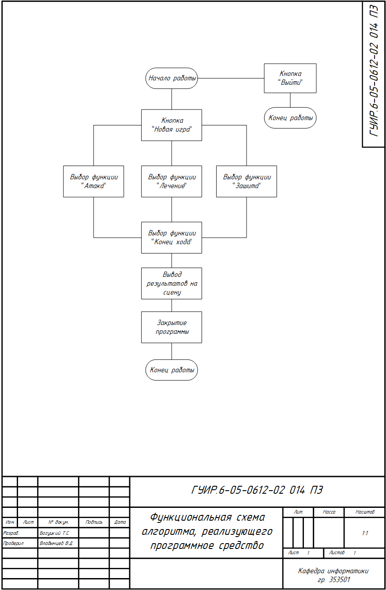

# Игра в стиле STS на С++

Данный курсовой проект представляет из себя карточную игру.

## Блок-схема алгоритма, реализующего получение урона главным героем

Применяется в: `source/NewGame/EndTurnButton.cpp`

## Блок-схема алгоритма, реализующего генерацию случайного урона

Применяется в: `source/NewGame/EndTurnButton.cpp`

## Блок-схема алгоритма, реализующего нанесение урона главным героем

Применяется в: `source/NewGame/EndTurnButton.cpp`

## Блок-схема алгоритма, реализующего окончание хода

Применяется в: `source/NewGame/EndTurnButton.cpp`

## Блок-схема алгоритма, реализующего восстановление здоровья

Применяется в: `source/NewGame/EndTurnButton.cpp`

## Функциональная схема игры в стиле STS

