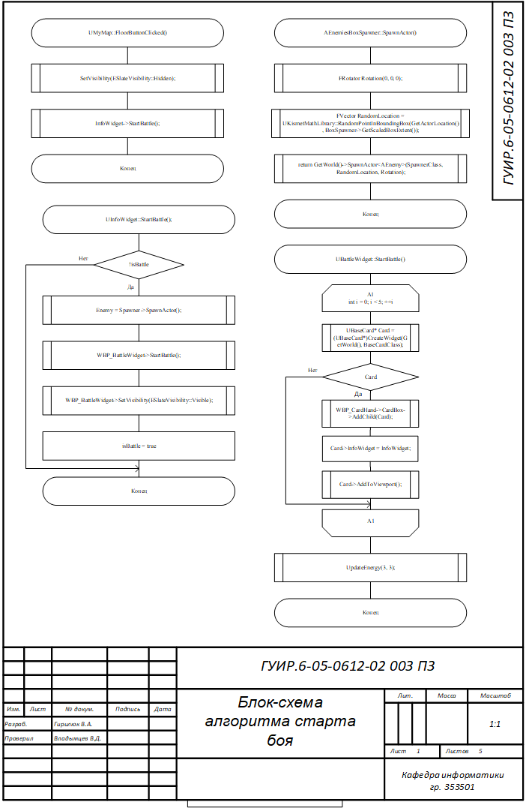
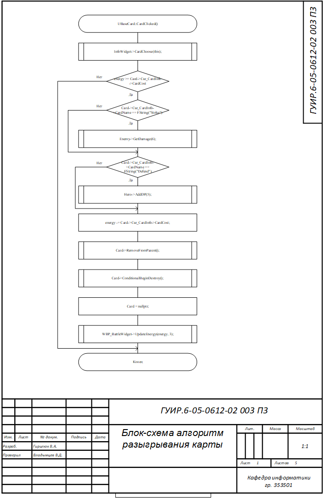
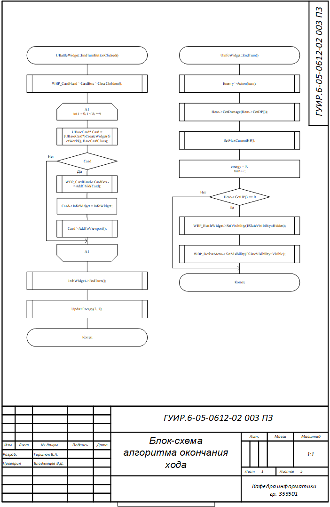
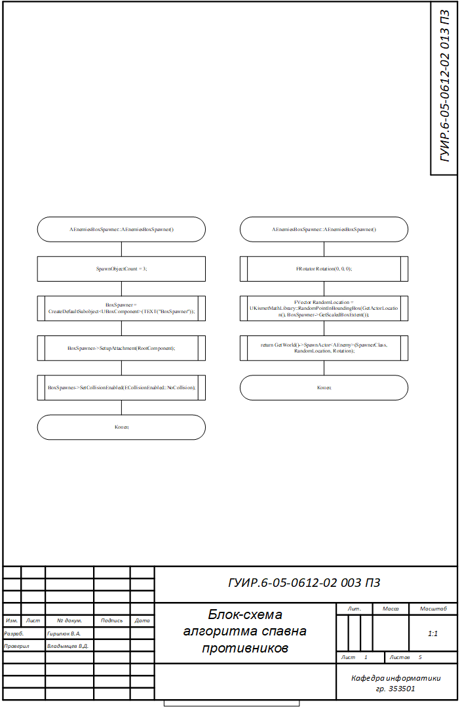
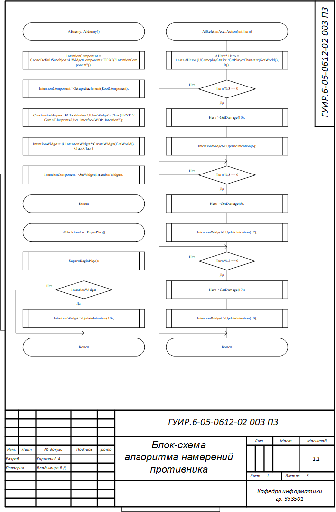
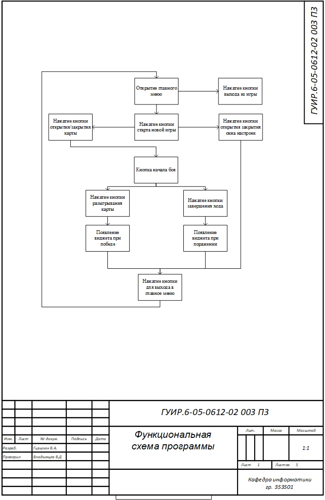

# Игра в стиле STS на С++

## Блок-схема алгоритма старта боя

Применяется в: `InfoWidget.h` в функции void void UInfoWidget::EndTurn()

## Блок-схема алгоритма разыгрывания карты

Применяется в: `InfoWidget.h` в функции void CardChoose(UBaseCard* Card)

## Блок-схема алгоритма окончания хода

Применяется в: `InfoWidget.h` в функции void EndTurn()

## Блок-схема алгоритма спавна противников

Применяется в: `EnemiesBoxSpawner.h` в функции AEnemy* AEnemiesBoxSpawner::SpawnActor()

## Блок-схема алгоритма намерний противников

Применяется в: `Enemy.h` в функции void Action(int Turn)

## Функциональная схема программы

