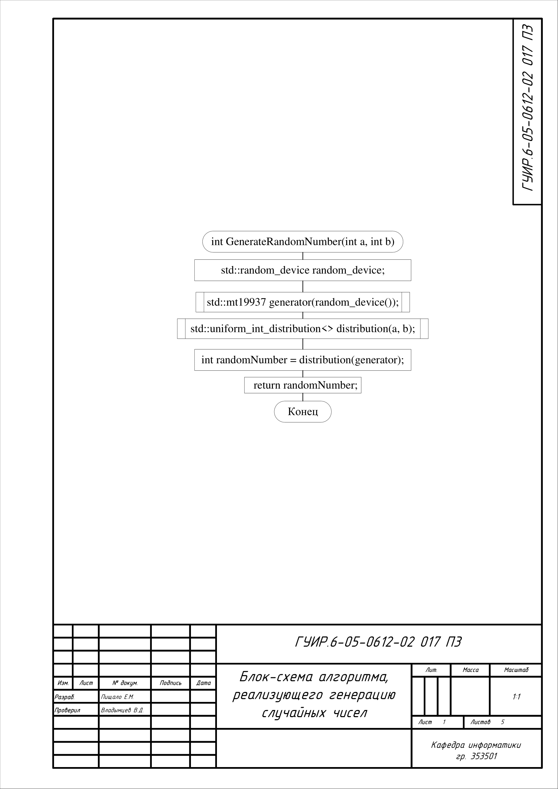
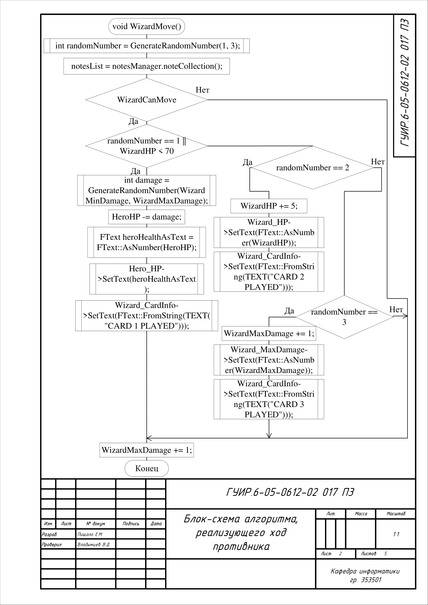
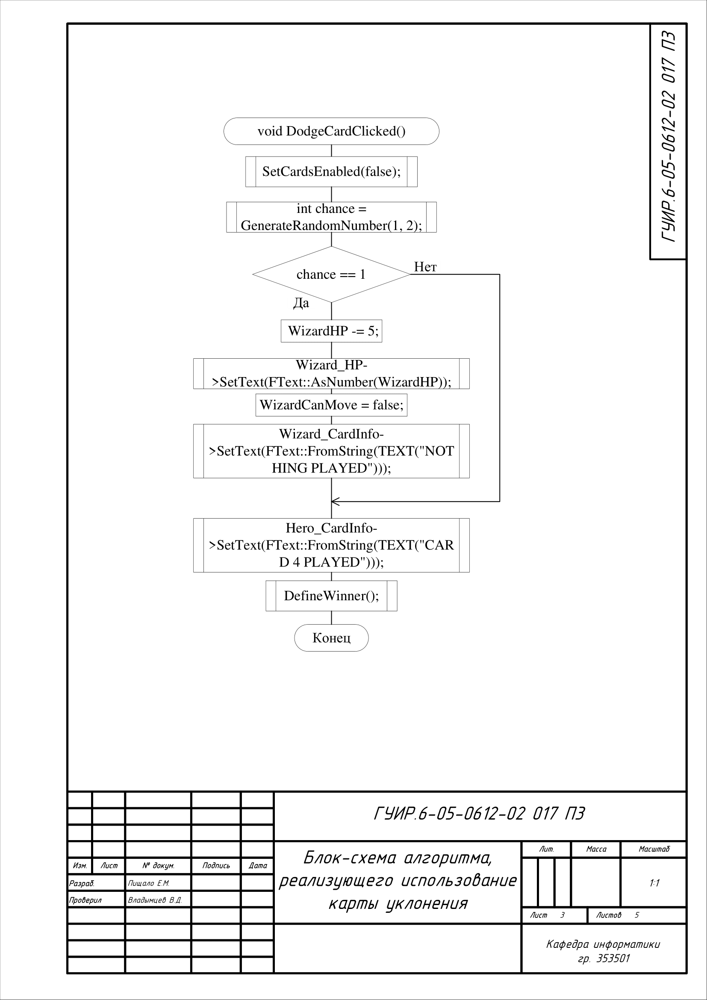
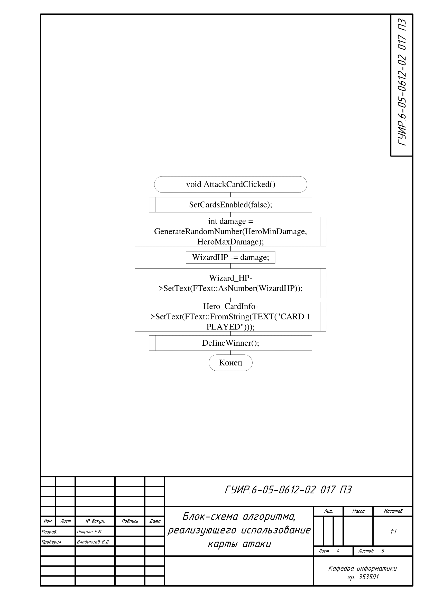
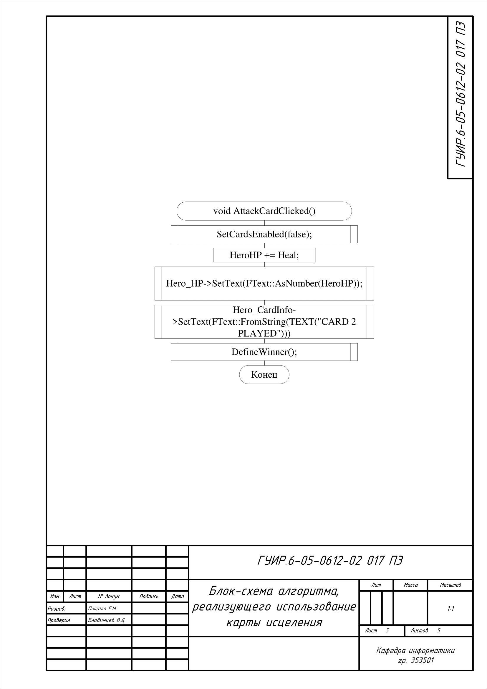

# Игра в стиле STS на С++

Данный курсовой проект представляет из себя копию игры Slay The Spire

## Блок-схема алгоритма, реализующего генерацию случайных чисел

Применяется в: `Source/MyUserWidget.cpp`

## Блок-схема алгоритма, реализующего ход противника

Применяется в: `Source/MyUserWidget.cpp`

## Блок-схема алгоритма, реализующего использование карты уклонения

Применяется в: `Source/MyUserWidget.cpp`

## Блок-схема алгоритма, реализующего использование карты атаки

Применяется в: `Source/MyUserWidget.cpp`

## Блок-схема алгоритма, реализующего использование карты исцеления

Применяется в: `Source/MyUserWidget.cpp`

## Функциональная схема игры-аналога Slay the Spire

