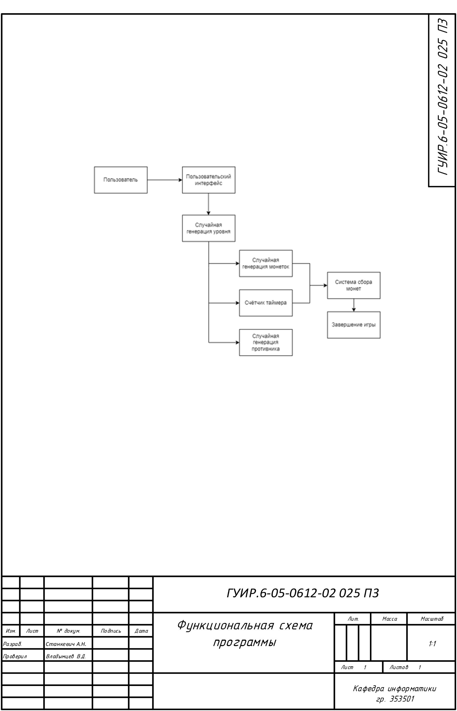
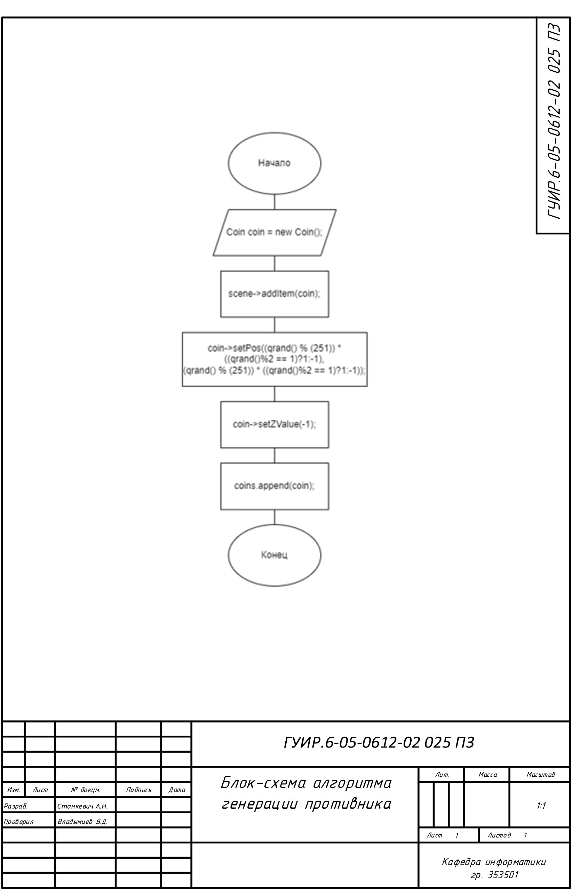
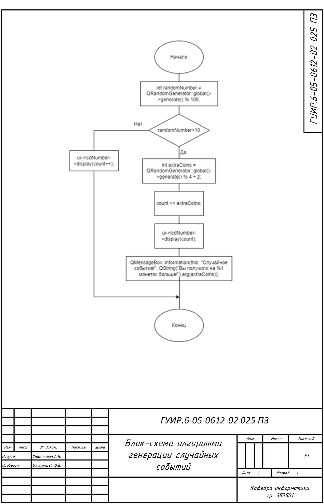
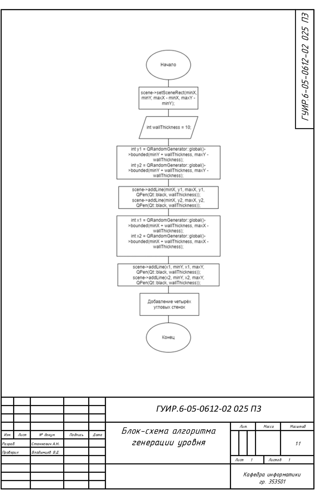

# Roguelike игра
## Функциональная схема программы
____

## Блок-схема алгоритма генерации предмета
____

Применяется в: coin.cpp
## Блок-схема алгоритма генерации противника
____

Применяется в: enemy.cpp
## Блок-схема алгоритма генерации случайных событий
____

Применяется в: mainwindow.cpp
## Блок-схема алгоритма генерации таймера
____

Применяется в: mainwindow.cpp
## Блок-схема алгоритма генерации уровня
____

Применяется в: mainwindow.cpp

