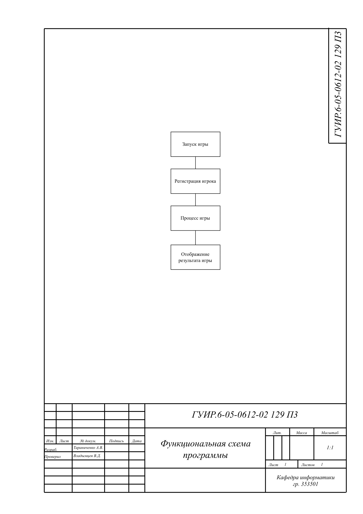
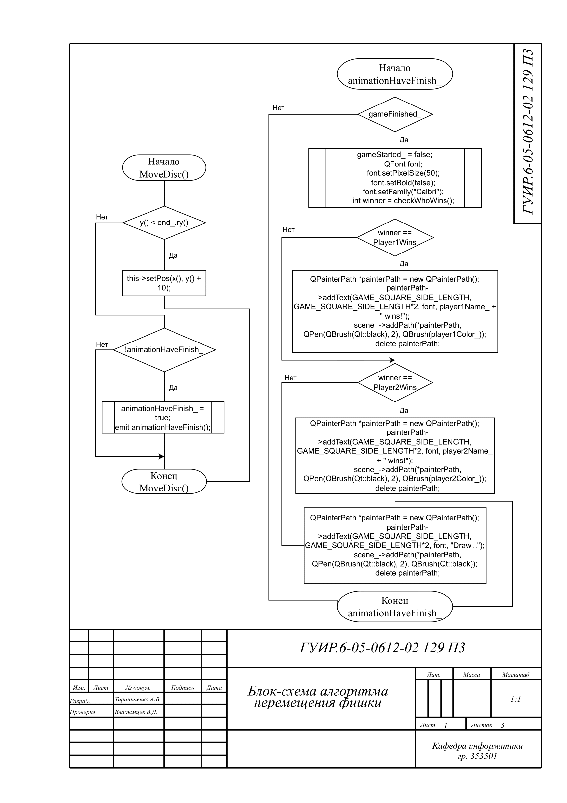
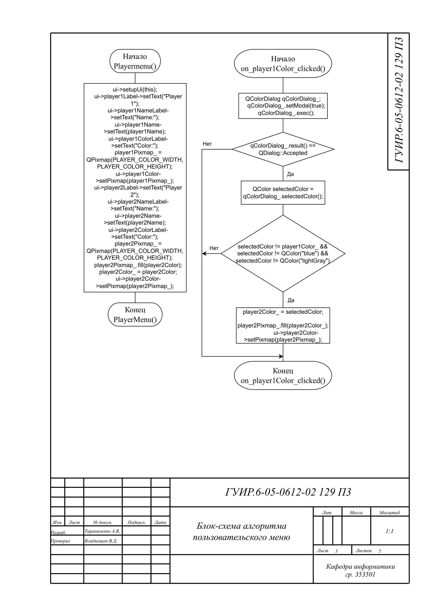
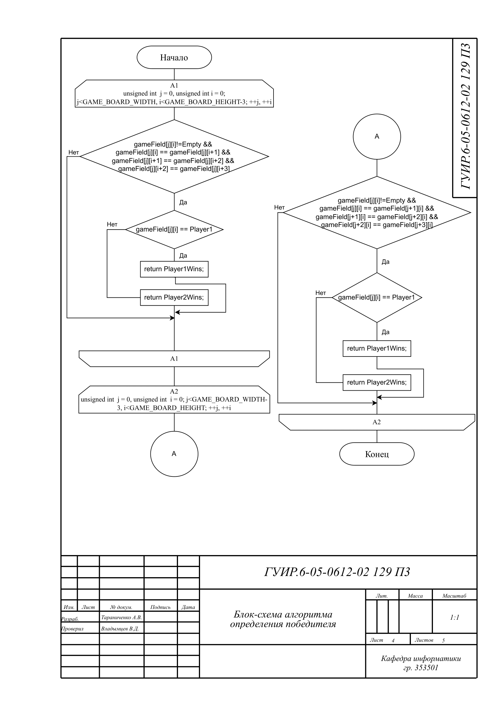
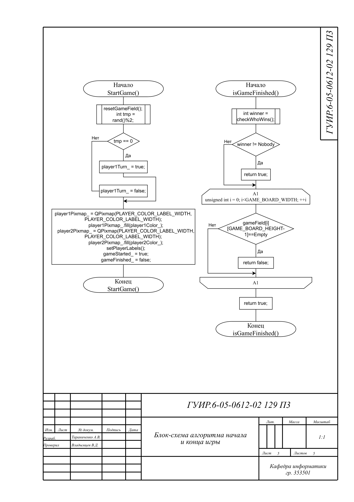

# РАЗРАБОТКА ИГРЫ 4 В РЯД

Даный проект заключается в разработке игры 4 в ряд на Qt.

## Функциональная схема программы

## Блок схема алгоритма перемещения фишки
Применяется в: `src/Mainwindow.cpp`

## Блок схема алгоритма пользовательского меню

Применяется в: `src/Mainwindow.cpp`

## Блок схема алгоритма определения победителя
Применяется в: `src/Mainwindow.cpp`

## Блок схема алгоритма проверки начала и конца игры

Применяется в: `src/Mainwindow.cpp`

## Блок схема алгоритма отображения игрового поля

Применяется в: `src/Mainwindow.cpp`

