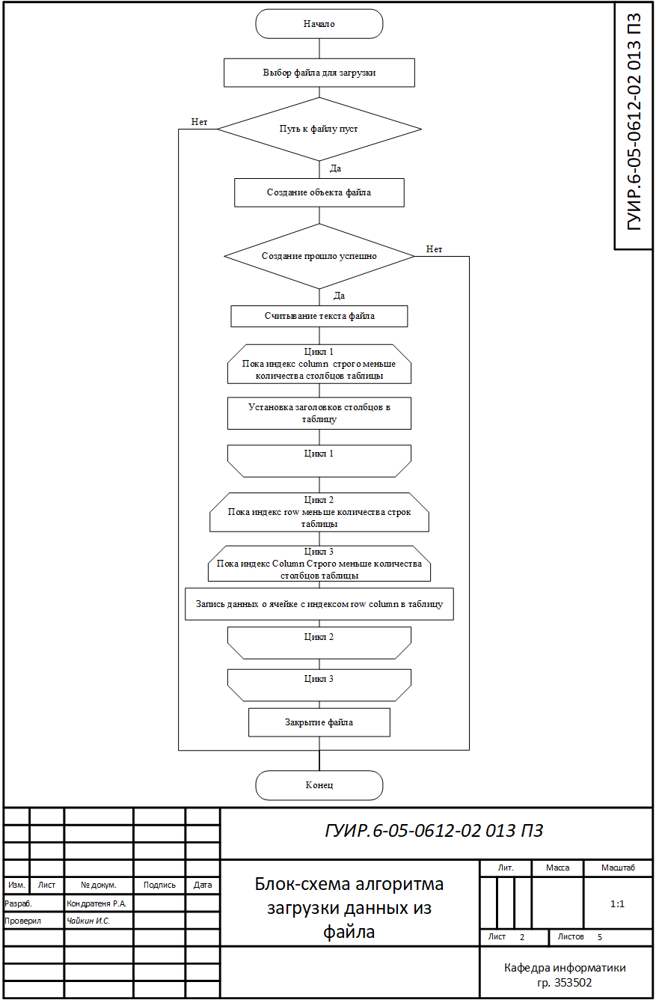
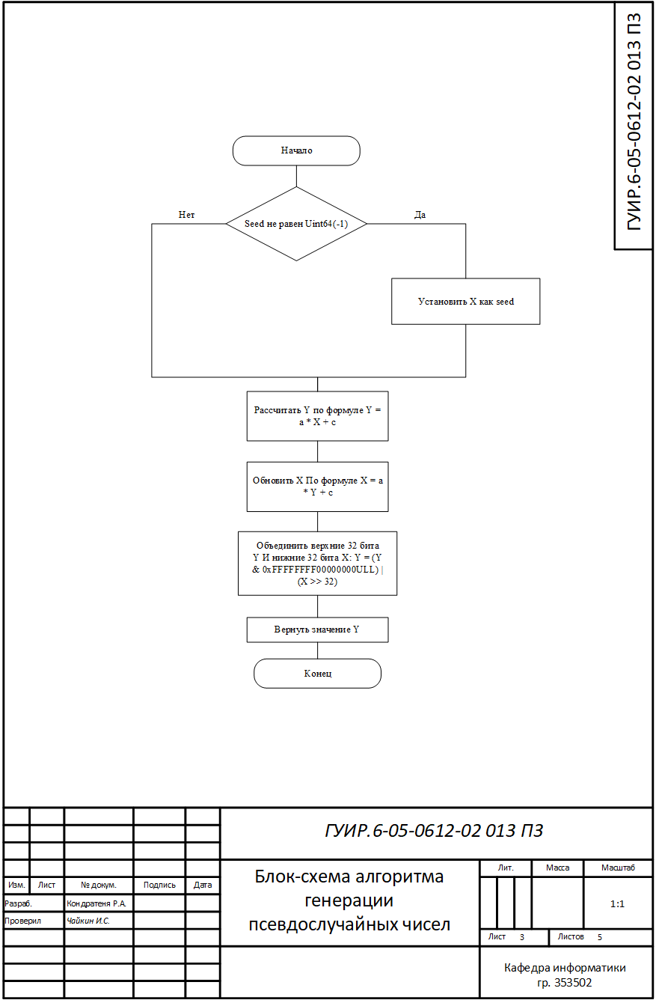
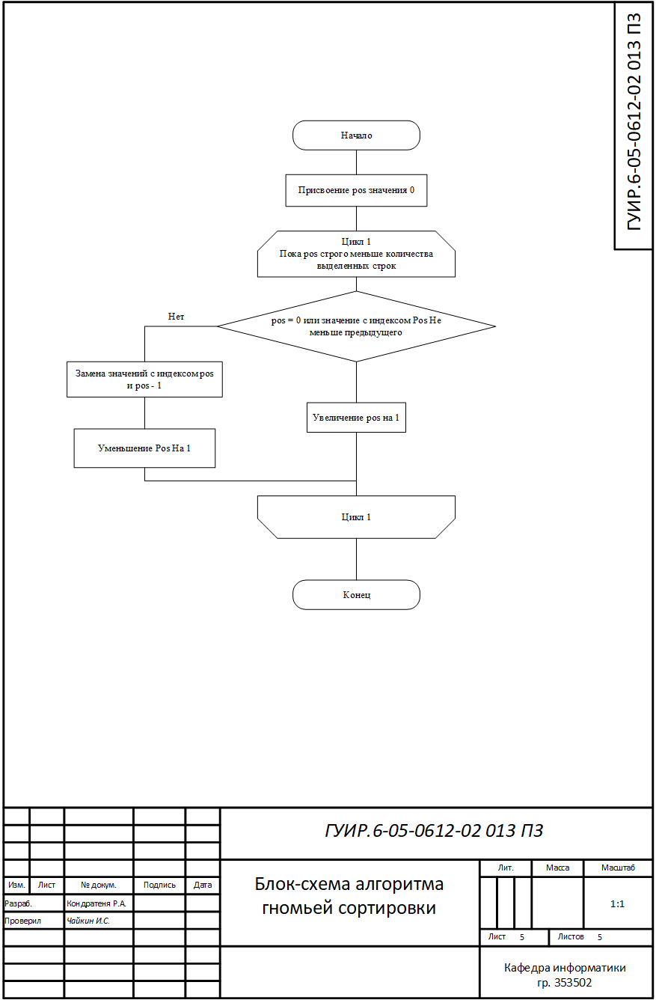

# Написание игры жанра Tower Defense

# Главной целью данной курсовой работы является написание приложения, предоставлющего возможность пользователю работать с данными, представленными в виде электронных таблиц. Она включает в себя реализацию следующих алгоритмов: алгоритм сохранения и загрузки данных таблиц, алгоритм генерации псевдослучайных чисел, алгоритм сортировки расчёской и алгоритм гномьей сортировки. В конечном результате будет получено полноценное приложение, реализующее все данные алгоритмы.

## Блок-схема алгоритма, реализующего сохранение данных таблицы в файл

Применяется в: `/Project/itemmodel.cpp`

## Блок-схема алгоритма, реализующего загрузку данных из файла

Применяется в: `/Project/itemmodel.cpp`

## Блок-схема алгоритма, реализующего генерацию псевдослучайных чисел

Применяется в: `/Project/function.cpp`

## Блок-схема алгоритма, реализующего сортировку расчёской

Применяется в: `/Project/itemmodel.cpp`

## Блок-схема алгоритма, реализующего гномью сортировку

Применяется в: `/Project/itemmodel.cpp`

