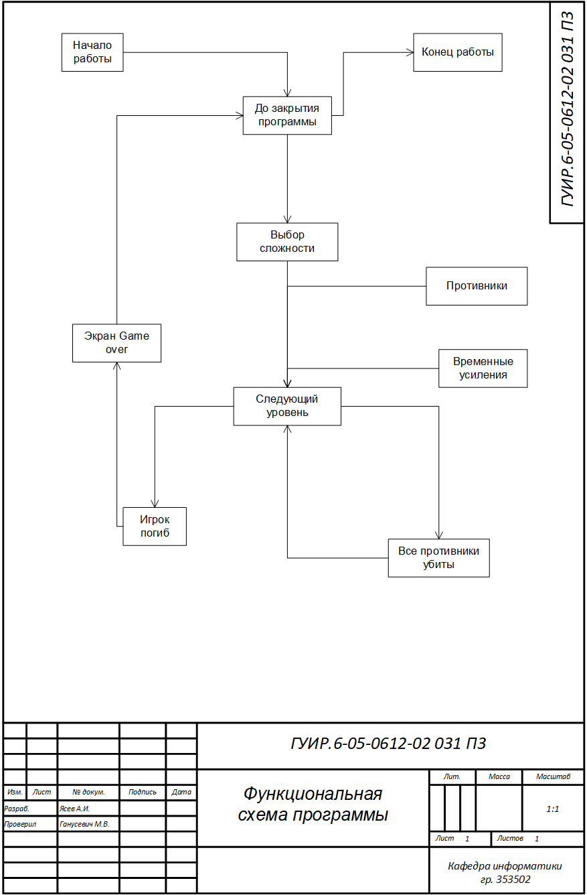
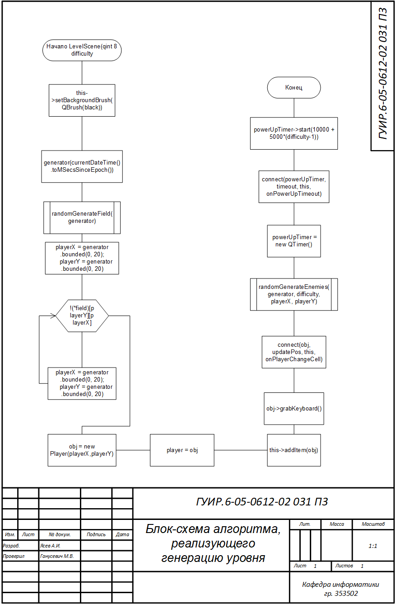
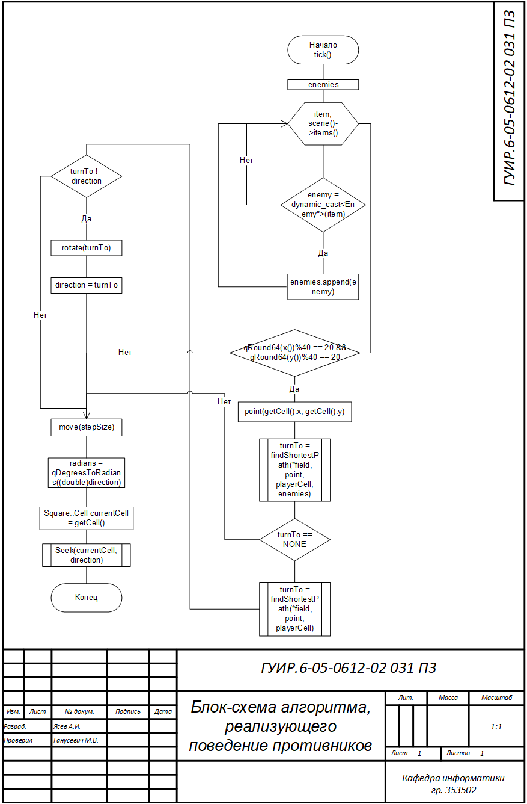
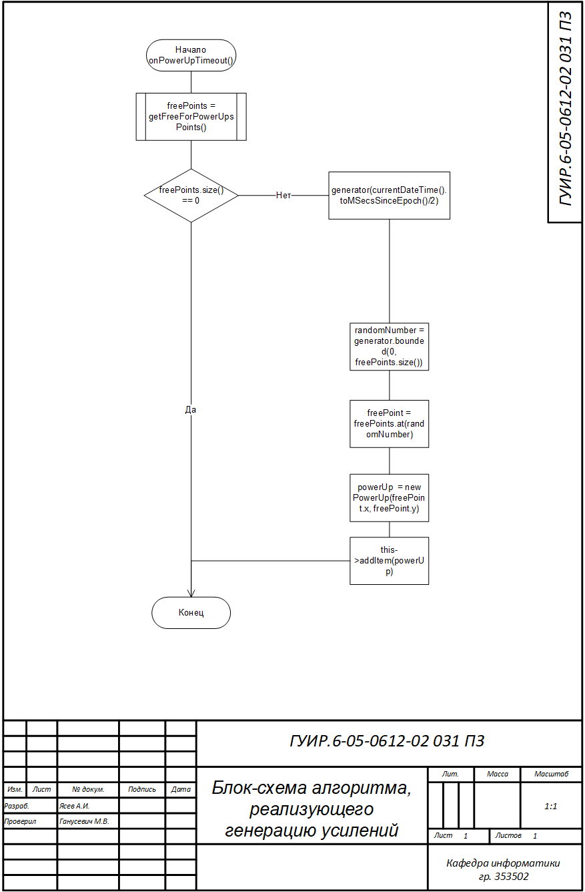
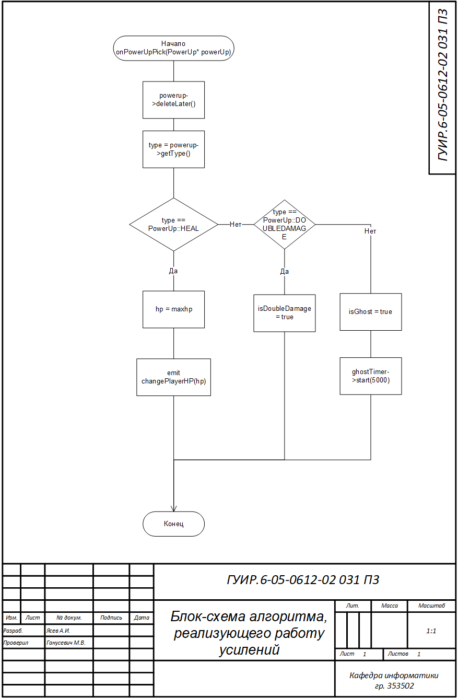

# Название Курсовой Работы

8-bit tanks

## Функциональная схема

## Блок-схема алгоритма, реализующего генерацию уровня

Применяется в: `kur_new/levelscene.cpp`

## Блок-схема алгоритма, реализующего перемещение, стрельбу и управление

Применяется в: `kur_new/tank.cpp`, `kur_new/player.cpp`

## Блок-схема алгоритма, реализующего поведение противников

Применяется в: `kur_new/enemy.cpp`

## Блок-схема алгоритма, реализующего генерацию усилений

Применяется в: `kur_new/levelscene.cpp`

## Блок-схема алгоритма, реализующего работу усилений

Применяется в: `kur_new/player.cpp`

