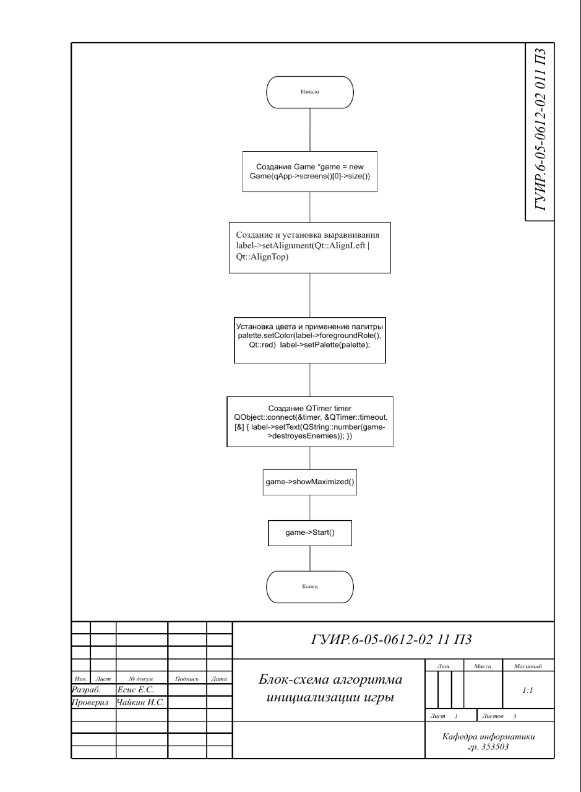
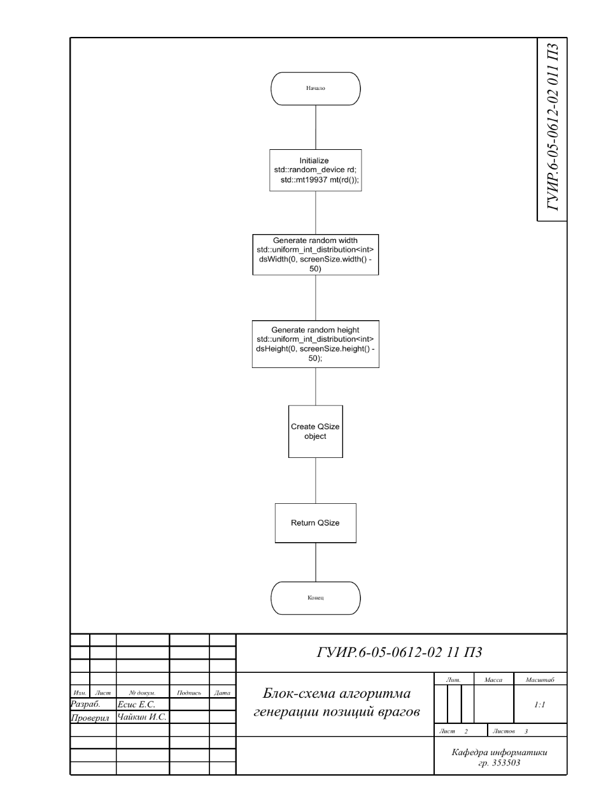
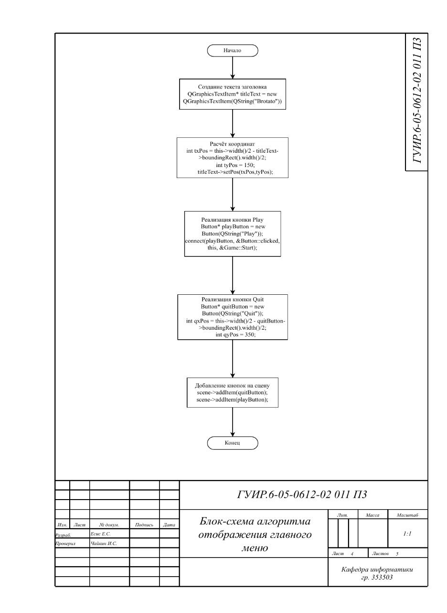
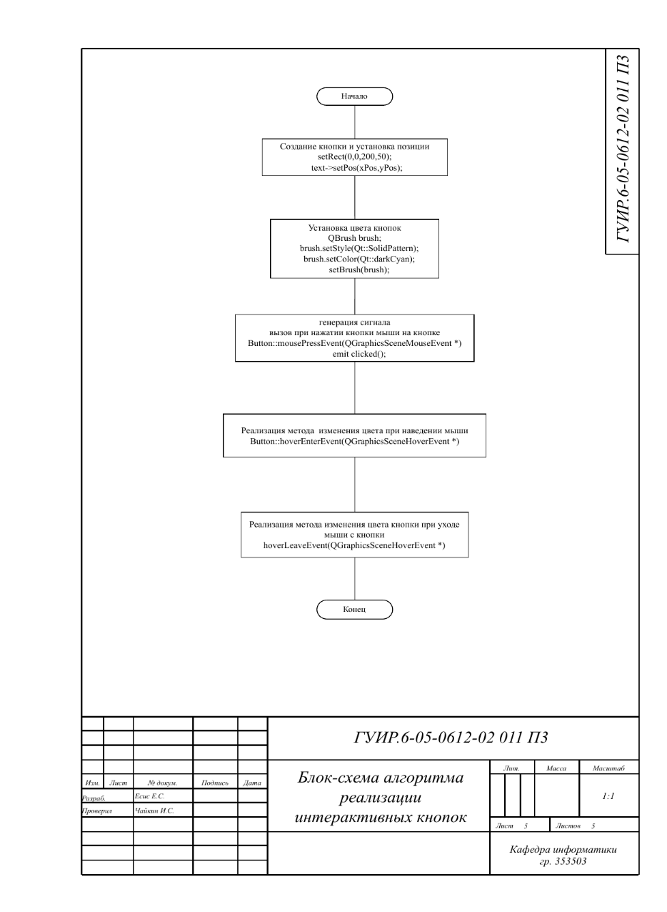

## Блок-схема алгоритма, реализующего инициализацию игры

Применяется в: `Fundamentals-of-algorithmization-and-programming/353503/Есис Е.С./Курсовая работа/Coursework/main.cpp` в методе main()

## Блок-схема алгоритма генерации позиций врагов

Применяется в: `Fundamentals-of-algorithmization-and-programming/353503/Есис Е.С./Курсовая работа/Coursework/Game.cpp` в методе getRandomPos(), результат работы применяется в методе createNewEnemy()

## Блок-схема алгоритма обработки коллизий

Применяется в: `Fundamentals-of-algorithmization-and-programming/353503/Есис Е.С./Курсовая работа/Coursework/Game.cpp` в методе removeEnemyOnCapture(), результат работы применяется в методе keyPressEvent(QKeyEvent *event)

## Блок-схема алгоритма отображения главного меню

Применяется в: `Fundamentals-of-algorithmization-and-programming/353503/Есис Е.С./Курсовая работа/Coursework/Game.cpp` в методе displayMainMenu(), результат работы применяется в методе main()

## Блок-схема алгоритма реализации интерактивных кнопок

Применяется в: `Fundamentals-of-algorithmization-and-programming/353503/Есис Е.С./Курсовая работа/Coursework/src/Button.cpp` в методе Button(QString name, QGraphicsItem *parent), результат работы применяется в методе displayMainMenu()

