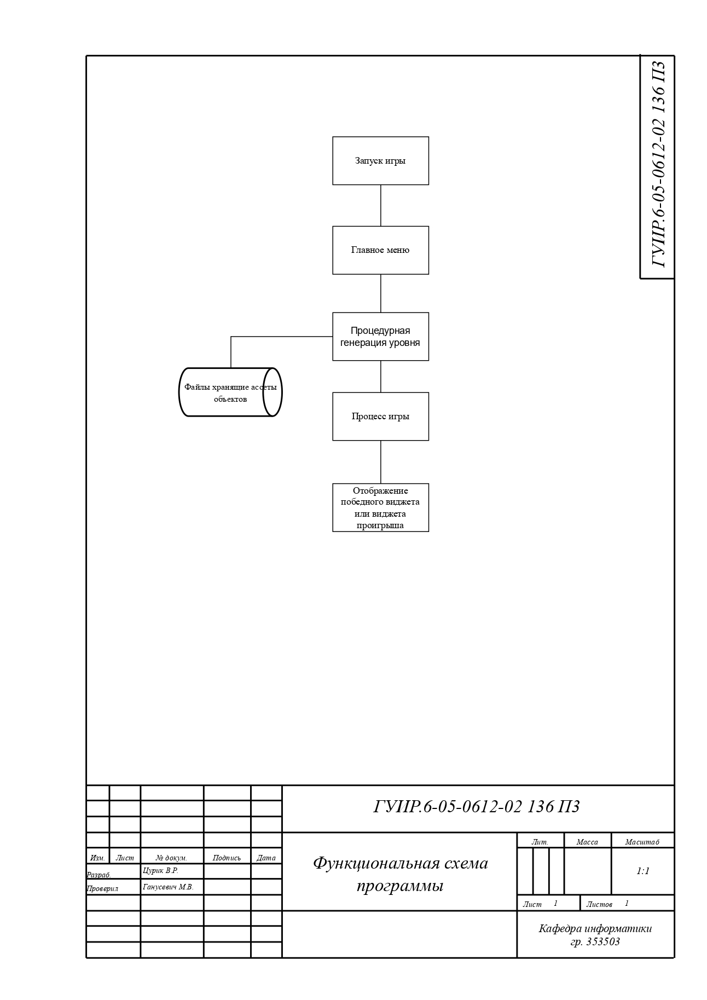
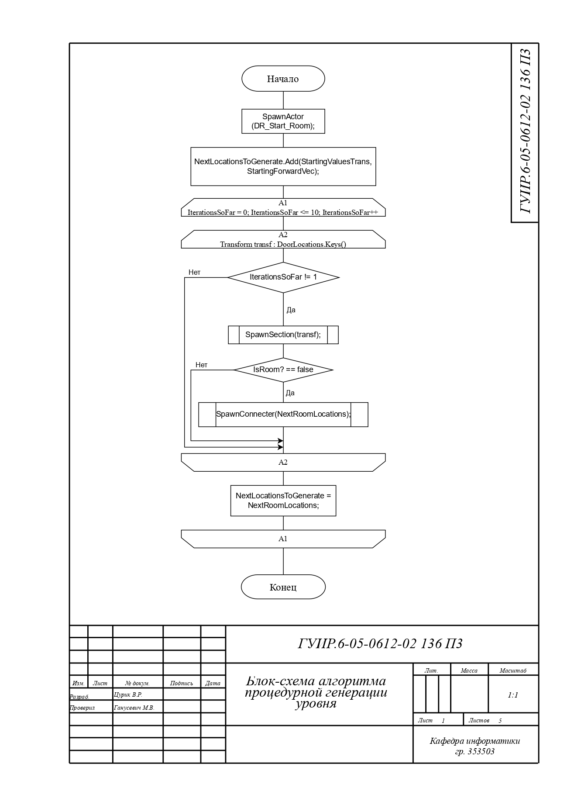
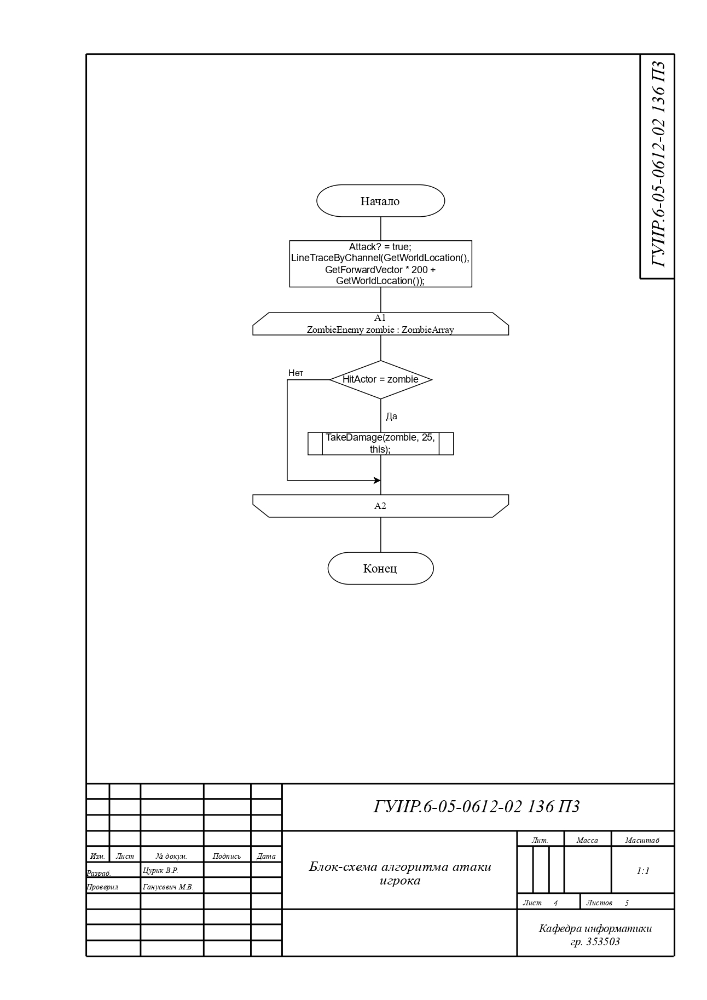
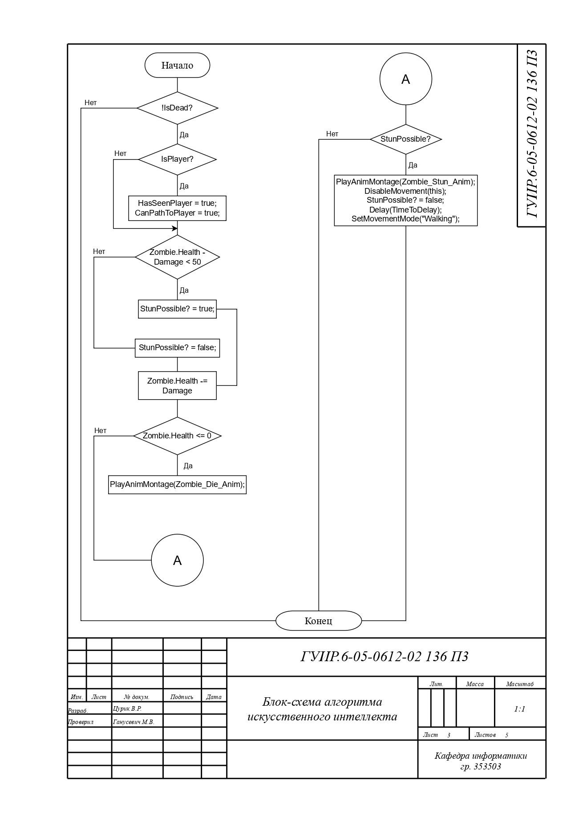
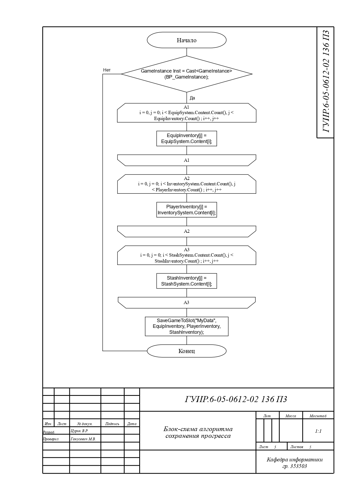
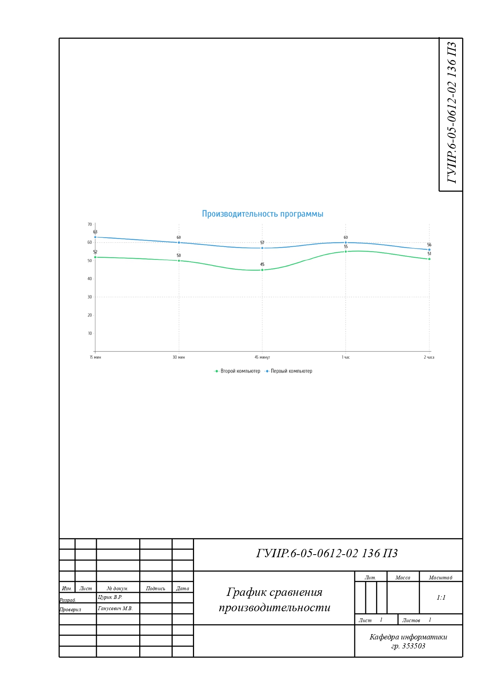

# Создание dungeon crawler игры

## Функциональная схема программы

Схема общей структуры программы.

## Блок-схема алгоритма процедурной генерации уровня

Алгоритм применяется в блюпринте уровня "Procedural Dungeon" по пути "./Content/Levels/ProceduralDungeon/ProceduralDungeon.umap".

## Блок-схема алгоритма экипировки предмета в системе инвенторя

Алгоритм применяется в блюпринте "Inventory_System" по пути "./Content/Inventory/Inventory_System.uasset" в функции "EquipItem".

## Блок-схема алгоритма атаки игрока

Алгоритм применяется в блюпринте "BP_FirstPersonCharacter" по пути "./Content/FirstPerson/Blueprints/BP_FirstPersonCharacter.uasset" в функции "Short Sword Attack".

## Блок-схема алгоритма исскуственного интеллекта

Алгоритм используется в блюпринте "ZombieEnemy" по пути "./Content/Enemies/ZombieEnemy.uasset".

## Блок-схема алгоритма сохранения прогресса

Алгоритм используется в блюпринте "BP_FirstPersonCharacter" по пути "./Content/FirstPerson/Blueprints/BP_FirstPersonCharacter.uasset" в функции "SaveInventories".

## График сравнения производительности

График сравнения производительности игры на разных компьютерах.

