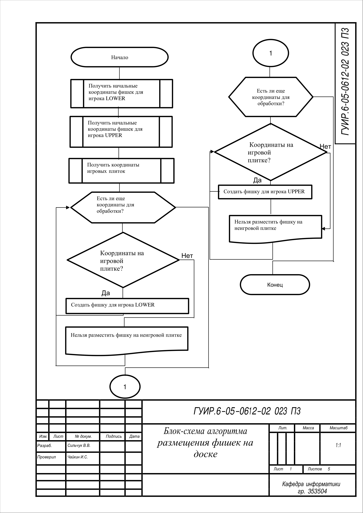
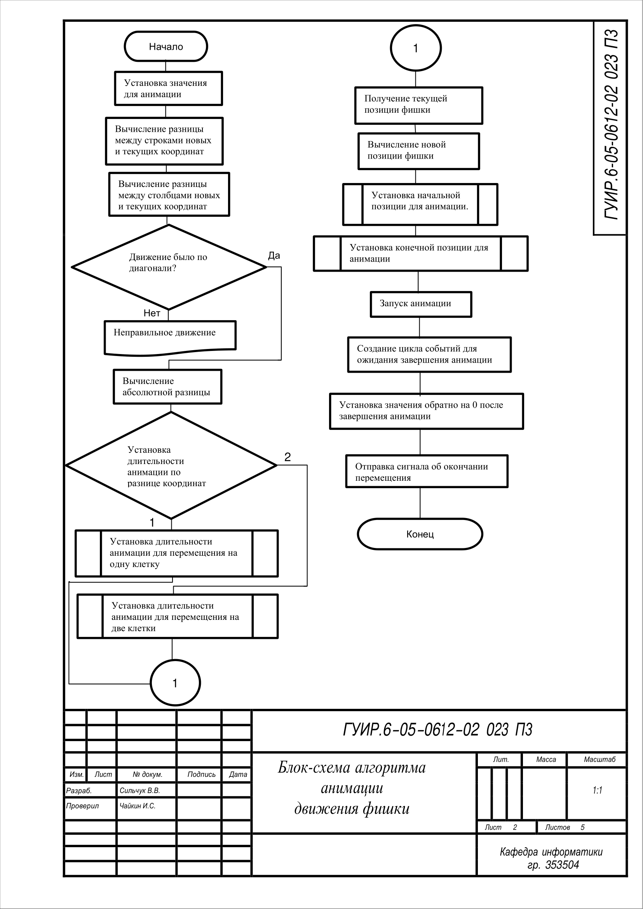
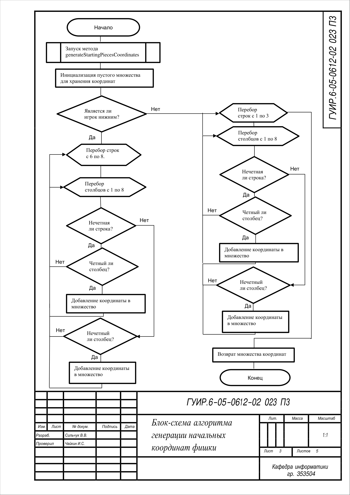
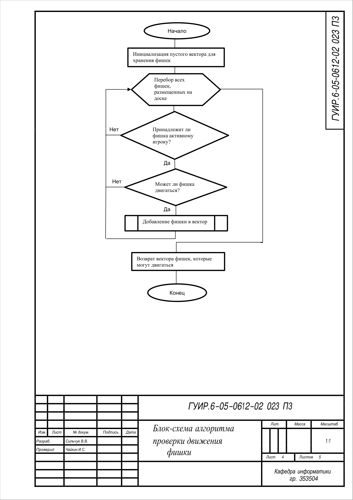
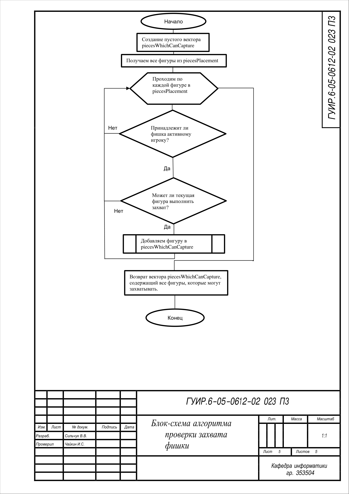

# Игра в стиле STS

## Блок-схема алгоритма размещения фишек на доске

Применяется в: `Checkers/pieces_placement.cpp`

## Блок-схема алгоритма анимации движения фишек

Применяется в: `Checkers/piece_frontend.cpp`

## Блок-схема алгоритма генерации начальных координат фишки

Применяется в: `Checkers/coordinates_database.cpp`

## Блок-схема алгоритма проверки движения фишки

Применяется в: `Checkers/piece_movement_manager.cpp`

## Блок-схема алгоритма проверки захвата фишки

Применяется в: `Checkers/piece_capture_manager.cpp`

