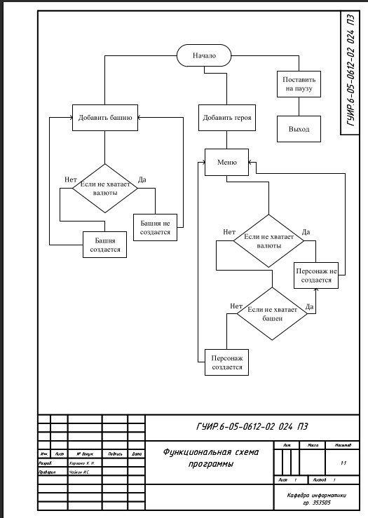
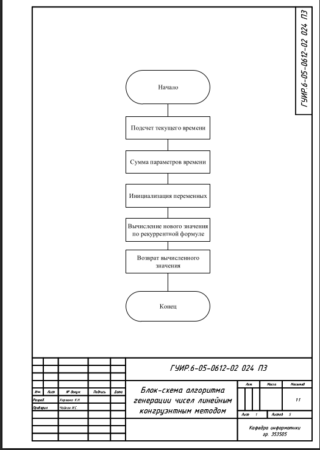
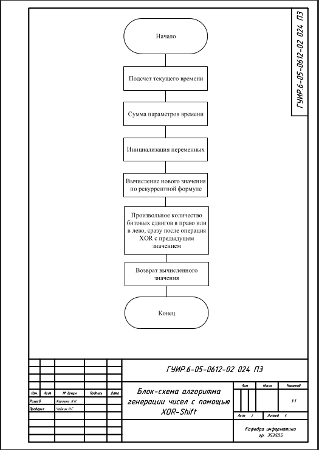
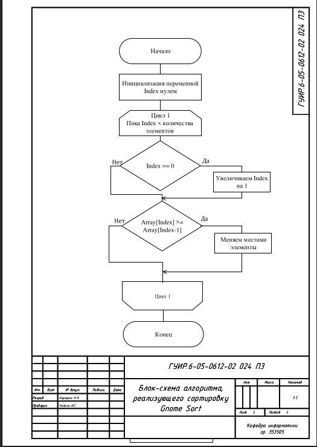
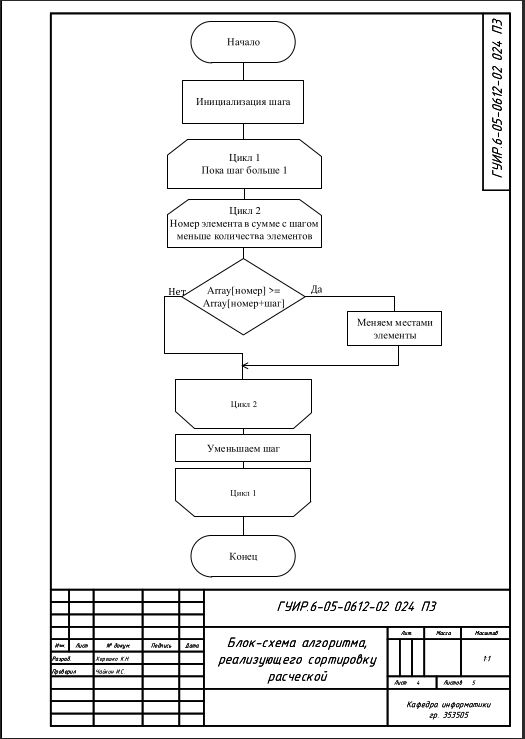
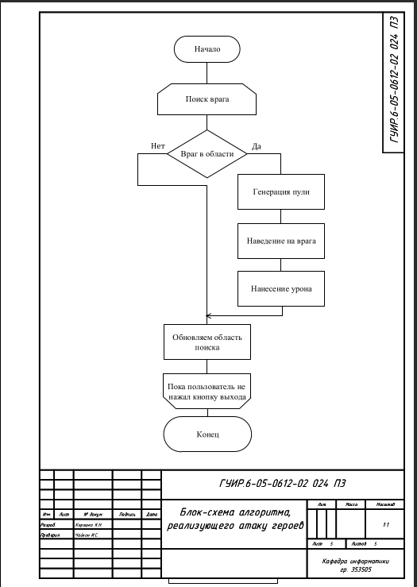

# РАЗРАБОТКА ИГРЫ АНАЛОГ CASTLE CROW 

Данная папка содержит разработанный курсовой проект с блок-схемами, приложенными к пояснительной записке данного проекта, с ссылками на реализацию данных алгоритмов в программе. 

## Блок-схема функциональной схемы программы

## Блок-схема алгоритма генерации чисел линейным конгруэнтным методом 

Применяется в: `MyProject2/Swap.cpp`

## Блок-схема алгоритма генерации чисел с помощью XOR-Shift

Применяется в: `MyProject2/Swap.cpp`

## Блок-схема алгоритма, реализующего сортировку Gnome Sort

Применяется в: `MyProject2/MyUserWidgetBlueprint.cpp`

## Блок-схема алгоритма, реализующего сортировку расческой

Применяется в: `MyProject2/MyUserWidgetBlueprint.cpp`

## Блок-схема алгоритма, реализующего атаку героев

Применяется в: `MyProject2/MyProject2.cpp`

